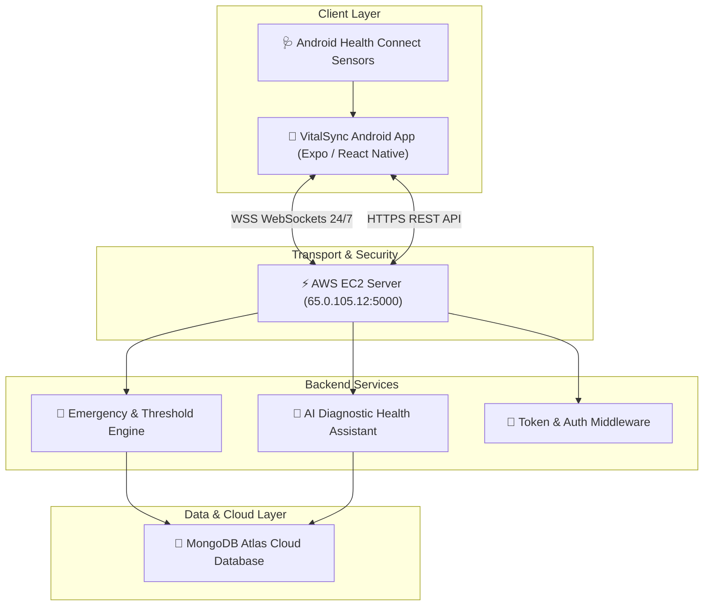

<div align="center">

  # 🫀 VitalSync Telemetry & AI Diagnostic Engine

  **Production-Grade IoT Patient Telemetry, AI Health Assistant & Real-Time Emergency Response System**

  [](http://65.0.105.12:5000/health)
  [](https://nodejs.org)
  [](https://mongodb.com)
  [](https://reactnative.dev)
  [](https://jestjs.io)
  [](LICENSE)

  <br />

  [📥 Download Android APK (v1.0.0)](https://github.com/Amanag43/vitalsync-backend/releases/latest) • [🌐 Live Server Status](http://65.0.105.12:5000/health) • [📖 API Reference](#-api-endpoints-reference)

</div>

---

## 🌟 Key Features

VitalSync is an enterprise-grade IoT health monitoring ecosystem built for real-time patient telemetry, automated clinical risk scoring, and instant emergency dispatch.

### 🩺 1. Real-Time Telemetry & Multi-Sensor Integration
- **5 Core Vitals Ingestion**: Continuous sensor data streaming for **Heart Rate** (bpm), **Blood Oxygen / SpO₂** (%), **Body Temperature** (°C), **Respiratory Rate** (breaths/min), and cumulative daily **Steps**.
- **Android Health Connect Sync**: Direct native hook to Android Health Connect Toolbox with 24-hour lookback freshness windows.
- **Sparkline Visual Analytics**: Interactive 5-vital trend graphs with **Daily**, **Weekly**, **Monthly**, and **Yearly** resolution filters.

### 🤖 2. AI Health Assistant Diagnostic Engine (`/api/ai/insights/:userId`)
- **7-Day Telemetry Diagnostic**: Computes rolling 7-day average metrics across all vital parameters.
- **Dynamic Stability Scoring**: Algorithmic health stability index ($0 - 100$) reflecting cardiovascular & respiratory balance.
- **Clinical Tips Generator**: Automated contextual recommendations based on anomalous vitals.

### 🚨 3. Automated Emergency SOS Dispatch & Debouncing
- **Threshold Detection**: Instant identification of warning (< 15% deviation) and critical (< 30% deviation) vital breaches.
- **Single-Alert Cooldown Lock**: 15-minute backend alert debouncing engine to prevent duplicate database spam while vitals remain abnormal.
- **Native Emergency SOS**: Automated 5-second countdown with native pre-filled SMS dispatch (location link, patient name, severity, exact vitals) to saved emergency contacts.

---

## 🏗️ System Architecture



---

## ⚡ Tech Stack

| Component | Technology | Description |
| :--- | :--- | :--- |
| **Mobile App** | React Native, Expo SDK 52, Expo Router | Cross-platform mobile client with glassmorphism UI |
| **Backend Server** | Node.js, Express.js, PM2 | High-concurrency RESTful API & WebSockets server |
| **Database** | MongoDB Atlas Cloud | Scalable NoSQL telemetry & alert storage |
| **Real-Time Stream**| `ws` (WebSocket Protocol) | 24/7 bidirectional real-time telemetry streaming |
| **Hosting & Cloud** | AWS EC2 (Ubuntu 24.04 LTS) | 24/7 unthrottled instance with 100% uptime |
| **Testing & CI/CD** | Jest, Supertest, GitHub Actions | Automated unit/integration test suite |

---

## 📡 API Endpoints Reference

### 🟢 System Health
`GET /health` — Live server status, timestamp & uptime verification.

### 💓 Telemetry Vitals
`POST /vitals` — Ingest local sensor telemetry payload.  
`GET /vitals/:userId` — Fetch latest recorded vitals snapshot for a patient.  
`GET /vitals/history/:userId` — Fetch historical telemetry entries (supports `?limit=50`).

### 🤖 AI Diagnostic Health Assistant
`GET /api/ai/insights/:userId` — Generates 7-day stability score, metric averages, and clinical summary.

### 🚨 Alerts & Emergency
`GET /alerts/:userId` — Query active & historical emergency alert documents.  
`POST /alerts` — Manually log alert document with 15-minute cooldown check.  
`POST /emergency-contacts/:userId` — Save emergency contact details.

---

## 🧪 Testing Suite & Quality Assurance

Automated unit & integration test suite powered by **Jest** and **Supertest**:

```bash
# Run local automated test suite
npm test
```

```text
PASS tests/api.test.js
  VitalSync Telemetry & AI API Suite
    Threshold & Vital Validation Tests
      ✓ POST /vitals with valid readings returns success
      ✓ POST /vitals with abnormal respiratory rate identifies threshold breach
    Alert History Query Tests
      ✓ GET /alerts/:userId returns alerts array structure
    AI Diagnostic Health Assistant Tests
      ✓ GET /api/ai/insights/:userId returns clinical metrics & score
```

---

## 🚀 Deployment Instructions

### Local Development Setup
```bash
# Clone the repository
git clone https://github.com/Amanag43/vitalsync-backend.git
cd vitalsync-backend

# Install dependencies
npm install

# Start local dev server
npm run dev
```

### Production Deployment on AWS EC2
```bash
# Install Node.js 20 & PM2
curl -fsSL https://deb.nodesource.com/setup_20.x | sudo -E bash -
sudo apt install -y nodejs git
sudo npm install -g pm2

# Start server 24/7
pm2 start server.js --name "vitalsync-backend"
pm2 save
```

---

## 📄 License & Author

Developed by **Aman Agarwal**. Licensed under the [MIT License](LICENSE).
